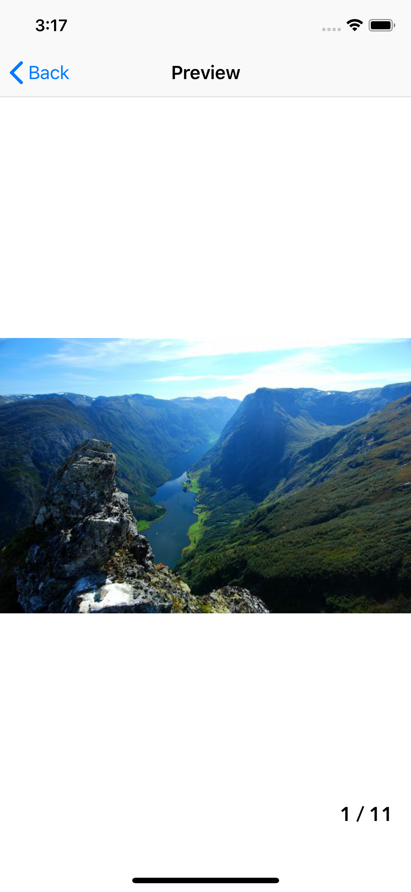
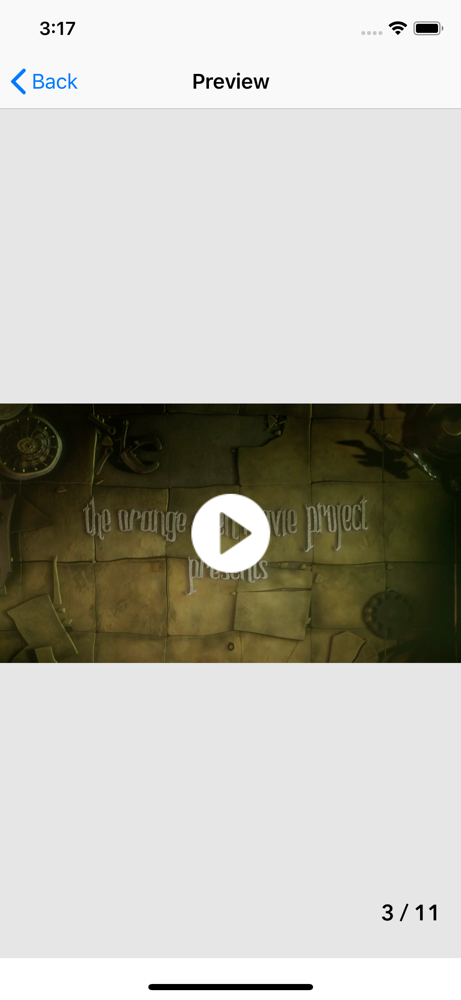
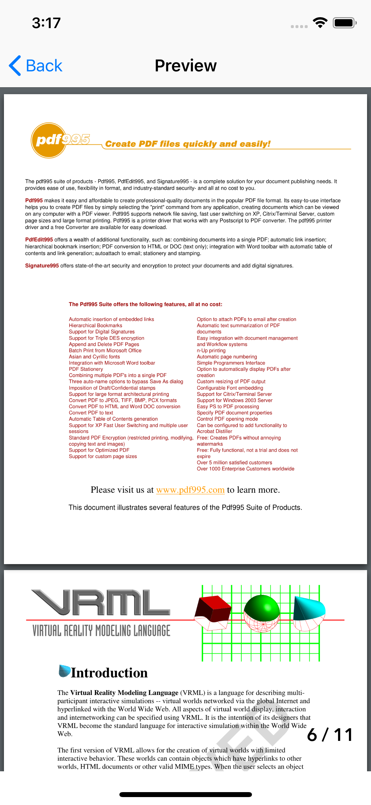
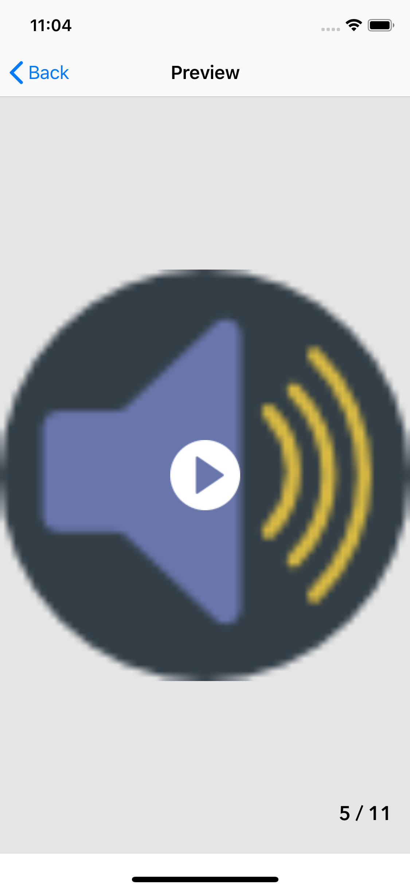

# CSFileBrowser

[](https://cocoapods.org/pods/CSFileBrowser)
[](https://cocoapods.org/pods/CSFileBrowser)
[](https://cocoapods.org/pods/CSFileBrowser)

This is an iOS library that shows an image,Pdf,Audio,Video with a page count. Users can scroll through local and remote image,Pdf,Audio,Video.

- Image  zooming
- Play video and audio
- Automatic video thumbnail generate
- Handling and caching photos from web
- Handling and caching video thumbnail from web

| Image | Video |
| ------------- | --------------- |
|  |  |

| PDF | Audio |
| ------------- | --------------- |
|  |  |


## Requirements

iOS 10.0+ | Xcode 9.0+ | Swift 4.2+

## Installation

CSFileBrowser is available through [CocoaPods](https://cocoapods.org/pods/CSFileBrowser). To install
it, simply add the following line to your Podfile:

```ruby
pod 'CSFileBrowser'
use_frameworks!
```

## Usage
See the code snippet below for an example of how to implement, or see the example project.

```swift
    var attachments = ["https://www.gstatic.com/webp/gallery/1.jpg",
                      "https://www.gstatic.com/webp/gallery/2.jpg",
                      "http://commondatastorage.googleapis.com/gtv-videos-bucket/sample/ElephantsDream.mp4",
                      "https://www.gstatic.com/webp/gallery/4.jpg",
                      "https://www.soundhelix.com/examples/mp3/SoundHelix-Song-1.mp3",
                      "http://www.pdf995.com/samples/pdf.pdf",
                      "https://www.gstatic.com/webp/gallery/5.jpg",
                      "http://techslides.com/demos/sample-videos/small.mp4",
                      "https://www.soundhelix.com/examples/mp3/SoundHelix-Song-5.mp3",
                      "https://easychair.org/publications/easychair.docx",
                      "http://www.africau.edu/images/default/sample.pdf"]
```                      

## if Attachment from DocumentDirectory

```swift
    
    if let documentsPathURL = FileManager.default.urls(for: .documentDirectory, in: .userDomainMask).first {
    
        for document in listFilesFromDocumentsFolder() ?? []{
            attachments.append(documentsPathURL.appendingPathComponent("/\(document)").path)
        }
    }
    
    ##Get Docuement Directory Attachment
    func listFilesFromDocumentsFolder() -> [String]? {
    
        let fileMngr = FileManager.default;
    
        // Full path to documents directory
        let docs = fileMngr.urls(for: .documentDirectory, in: .userDomainMask)[0].path
    
        // List all contents of directory and return as [String] OR nil if failed
        return try? fileMngr.contentsOfDirectory(atPath:docs)
    }
```     

```swift                      
    CSFileBrowser.openAttachmentSlider(navigation: self.navigationController!, attachment: attachments)
``` 
    
## Author

Mayur Amipara

## License

CSFileBrowser is available under the MIT license. See the LICENSE file for more info.
